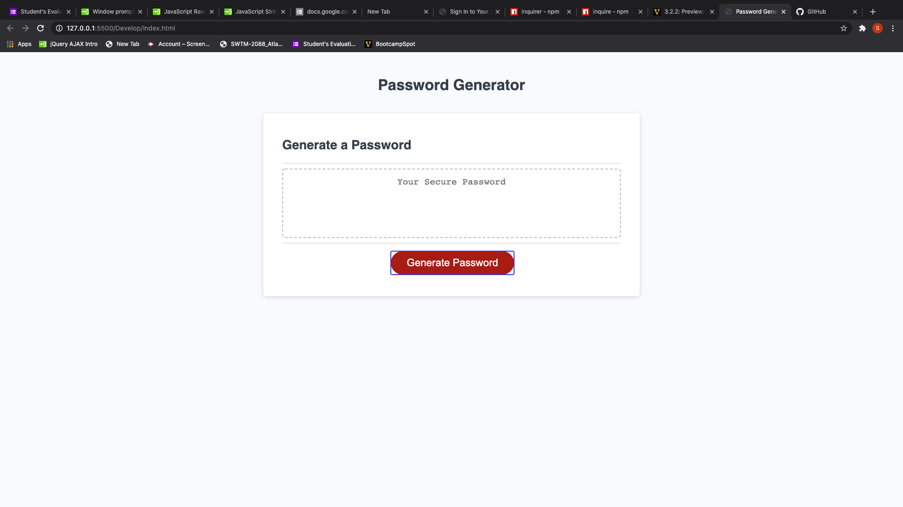

# Password-Generator

<strong>Password-Generator</strong>

The name of this app is <i>Password-Generator</i> it is designed to use in generating random password for the user

<strong>Image</strong>

<strong>Description</strong>
This application is designed to help its users to be able to randomly generaate password between 8 and 128 characters using lower cases, upper cases, numbers and special characters in whatever combination its users chooses to use.

<strong>Technology used</strong>
In building this app, I used HTML and CSS which was powered by Javascript.

<strong>Installation</strong>

This project does not need any installation,rather it is currently hosted on github, which can be accessed by clicking on the link below
https://toksly.github.io/Password-Generator/

<strong>Usage</strong>

The page is simple, clean, and easy to use and undertand. It allows the user to be able to randomly generate password using lower cases, upper cases, numbers, and special symbols in any combination the user wishes.

<strong>Support and Contribution</strong>
If you have any question or want to see my Repo, please email me at nwizutoks@gmail.com
